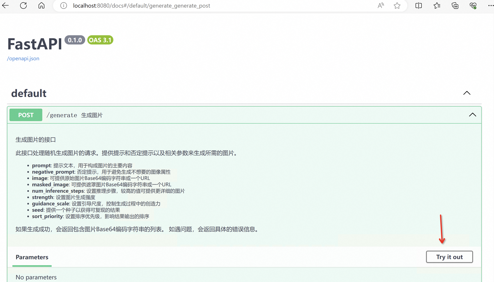

# AnyText(非官方实现)

# 安装


```
# 1. clone project
git clone https://github.com/MaletteAI/anytext.git

cd anytext

# 2. create venv

pythont -m venv venv

# 3. 激活 venv （Windows powershell）
./venv/Scripts/activate

# 3. 激活 venv （WSL）
./venv/bin/activate

# 1. install torch

pip install torch==2.2.2 torchvision==0.17.2 torchaudio==2.2.2 --index-url https://download.pytorch.org/whl/cu121

# 2. install requirements

pip install -r requirements.txt

```

# 下载模型

进入 models 目录

```
cd models
```

下载必选模型

```
git clone https://www.modelscope.cn/iic/cv_anytext_text_generation_editing.git anytext_models
```

# 使用

## 本地调试

```

python main.py

```

## 启动 API 服务

```
python app.py
```

访问：http://localhost:8080/docs



点击 "Try it out" 测试效果

# FAQ
### Q: 遇到 FullyQualifiedErrorId : UnauthorizedAccess 报错
> 以管理员身份打开 PowerShell 输入 set-executionpolicy remotesigned，并输入Y。
```
PS C:\WINDOWS\system32> set-executionpolicy remotesigned

执行策略更改
执行策略可帮助你防止执行不信任的脚本。更改执行策略可能会产生安全风险，如 https:/go.microsoft.com/fwlink/?LinkID=135170
中的 about_Execution_Policies 帮助主题所述。是否要更改执行策略?
[Y] 是(Y)  [A] 全是(A)  [N] 否(N)  [L] 全否(L)  [S] 暂停(S)  [?] 帮助 (默认值为“N”): y
```


# Credit to

+ [AnyText](https://github.com/tyxsspa/AnyText) 官方项目
+ [IOPaint](https://github.com/Sanster/IOPaint) 代码参考

# Other Things
you can contact me at Twitter: https://twitter.com/jinchanzx
